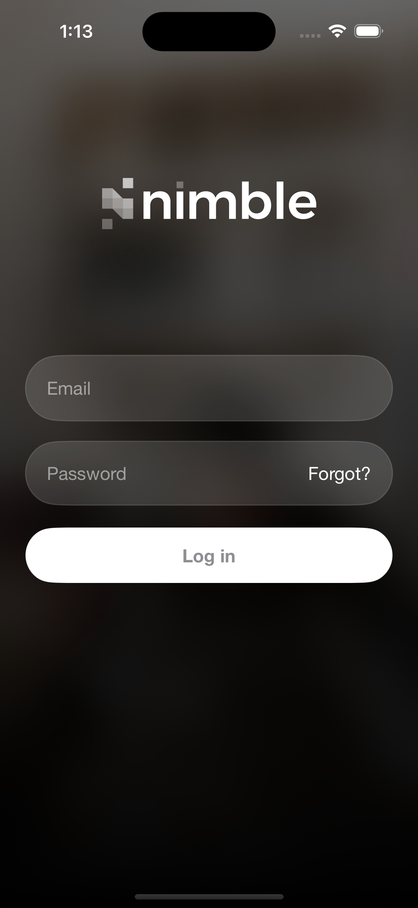
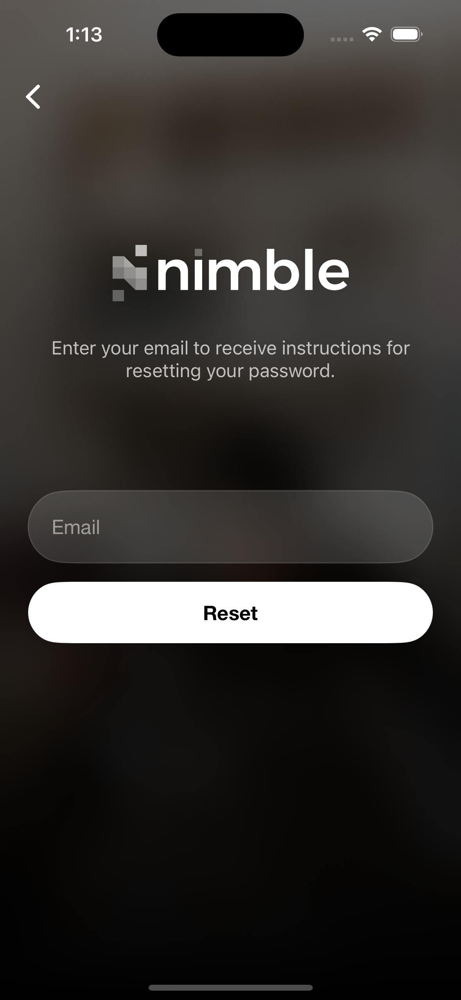
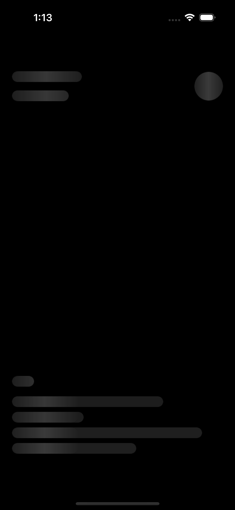
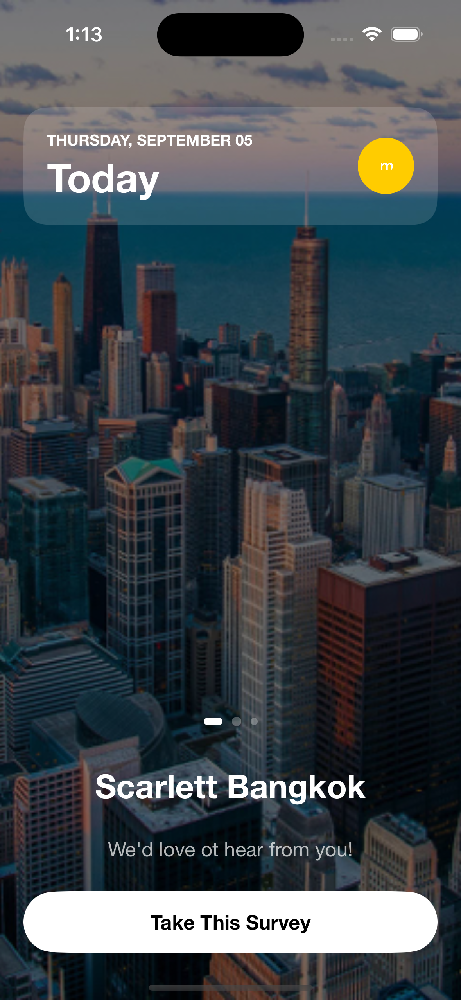
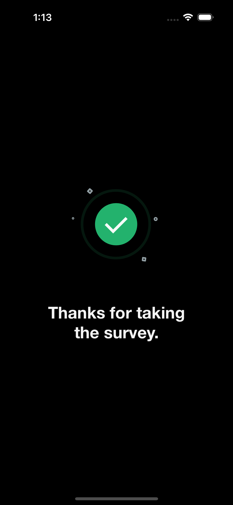

# 📝 Nimble-Code-Challenge

## 1. 🚀 Introduction

This project is an iOS application developed using **SwiftUI** and **Combine**, following the **Clean Architecture** pattern. The application integrates with an OAuth 2.0 API, allowing users to log in, browse a list of surveys, and navigate between different screens such as Splash, Login, Home, and Success.

## Installation

This project uses **Swift Package Manager** to manage third-party libraries, which will be automatically fetched when building the project.

## Requirements

- iOS 15 or later
- Xcode 15.4 or later

## Usage

**Setup SSH for Cloning**: Ensure that your **SSH key** is set up in your GitHub account and configured in **Xcode** for smooth cloning and package fetching. You can verify this under **Xcode > Preferences > Accounts**.

1. Clone the repository.
2. Open the project with.
3. The **Swift Package Manager** will automatically fetch the required dependencies when you open the project.
4. Build and run the project on a device or simulator running **iOS 15** or later.

|  |  |  |  |  |  |
|---|---|---|---|---|---|

## Technologies

- **SwiftUI** & **Combine** & **MVVM** 
- **Alamofire**
- **Kingfisher** 
- **IQKeyboardManager**
- **Lottie**
- **SwiftLint**

---

## 2. ✅ Feature Checklist

### 🌟 Splash Screen
- [x] Implement the splash screen UI.
- [x] Add animation for the splash screen.

### 🔑 Authentication
- [x] Implement the login UI.
- [x] Implement the OAuth authentication flow, including token storage and refresh logic.
- [x] Add a "Forgot Password" screen and functionality.
- [x] Add a logout button (via avatar) for testing the authentication flow.

### 📋 Survey Home
- [x] Implement the survey list UI with horizontal scroll.
- [x] Fetch the surveys when the view appears.
- [x] Add pull-to-refresh functionality.
- [x] Display dynamic bullet indicators based on the survey list.
- [x] Show loading animation when fetching or refreshing surveys.

### 🎉 Success Screen
- [x] Implement the success screen UI.
- [x] Add animation to the success screen.
- [x] Auto-navigate back after 5 seconds.

---

## 3. 🔧 CI/CD

- [x] Run unit tests using Fastlane.
- [ ] Integrate GitHub Actions to trigger Fastlane (Pending: GitHub Actions only work for public repos on free accounts).

---

## 4. 🧪 Unit Tests Checklist

- [x] Unit test for OAuth authentication flow.
- [x] Unit test for token storage and refresh logic.
- [x] Unit test for pulling surveys from the API.
- [x] Unit test for displaying surveys in the list.
- [x] Unit test for the logout functionality.
- [x] Unit test for UI animation on the splash screen and success screen.
- [ ] Unit test for pull-to-refresh functionality.
- [ ] Unit test for navigation back from the success screen.

---

## 5. 📚 References

- [Nimble iOS Templates](https://github.com/nimblehq/ios-templates)
- [iOS Clean Architecture MVVM](https://github.com/kudoleh/iOS-Clean-Architecture-MVVM)
- [Why Select iOS Clean Architecture?](https://suho.dev/posts/why-select-ios-clean-architecture/)

---
